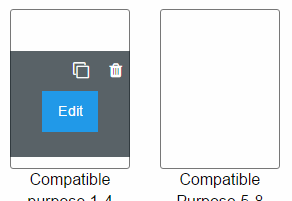
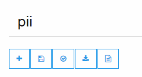
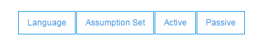
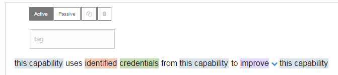
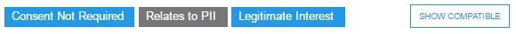

# Installation & Start

For instructions on how to install and start this programm please follow the 
step-by-step instructions provided on the [download page](https://github.com/Microsoft/DUCK/releases).

# Usage

## Account Creation

The first time after starting the DUCK application a new 
useraccount has to be created. 

## Overview
After logging in the document overview  is shown. On this site existing documents can be accessed and new ones created.

Already populated testdocuments can be created by using the `Create Test Document` button on the upper right.
The  testdocuments are named after their validation result. As an example, the `No PII Example` testdocument will have no statement that relates to PII.

When hovering over a document, three actions become visible:
   - A `Edit` Button which opens the document view and
   - An icon of a bin which will delete that document
   - An icon of a paper sheet behind another one which will create a copy of this document

## Document view

In the document view two set of buttons are present. One on the left under the documents title, the other on the right under the validation result.
If a document has statements, these will be shown in the field under these buttons.

The left button set has, from left to right, a button to add a new statement, a button to save the document, one button to validate the document and one button to download the document.

The right set of buttons controls the documents language and the form of the statements, whether they are active or passive. The `Assumption Set` button has no functionality at this time.

### Statements

Each statement is shown in its own box. Each box contains the statement as a natural sentence.
The colored parts of the statement are editable, by selecting it and then pressing the down arrow,
 and represent the fields defined in ISO 19944.
In each box are also an input field for a tag to identify this statement and four buttons. The first two buttons,
`Active` and `Passive` switch the state of only this statement, independent of the documents state. 
The other two are already known from the overview and are used to copy and delete this statement.

#### Custom Terms
It is possible to create ustom terms for scope and data category by opening the dropdown menue 
(click on field & press arrow down key) and then scrolling to the bottom to the `New term...` control.

A new window pops up where the custom term can be defined. The first input field is for 
the terms name and the second for the category the term should be placed. 

In DUCK are two types of dictionaries in which a custom term can be stored:
- Document dictionary: the custom term is only accessible for this Document
- global dictionary: the custom term is accessible in the whole application

### Validation
After validating the document via the `validate` button on the top left three new fields and a button are visible for each statement:

- `Relates To PII` or `Does not Relate to PII`: This field shows whether that statement relates to PII.
- `Legitimate Interest` or `No Legitimate Interest`: This field communicates whether that statement contains a legitimate interest of the CSP.
- `Consent Not Required` or `Consent Required`: This field shows whether this is a statement that requires consent.

The fields are *blue* if DUCK can *prove* that the fields assertion is true. They are *grey* when no counterargument is found.

The button `Show Compatible` reduces the statements to only the ones that have a compatible purpose to that specific statement. To see all statements again the button `SHOW ALL` on the top of the page has to be used.

The documents *validation result* is displayed on the top right of the page.
